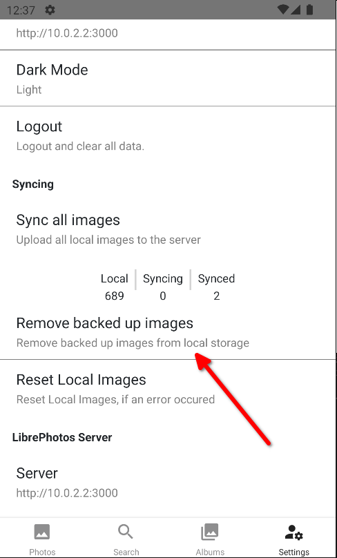

### Upload a single photo

Click on a local photo and click on the upload button in the top left corner.

### What kinds of files are supported?

We accept all files that have a mime type of image.

### How does it work?

The upload process works in the following way:

- Check if file is on the server by comparing the hash `md5 + user_id`
- If it is, don't upload it
- If it isn't, upload it
- We upload files in 1MB chunks
- If all files are uploaded, we scan the your `scan folder + /upload/web`
- Mark the photo as synced

### Where are the files saved?

- If all the chunks are uploaded, we combine them into a single file and put them in your `scan folder + /upload/web`

### Backup all photos

You can backup all photos by clicking on the `Sync all images` button in the settings.

### Delete synced photos

You can delete all backed up photos by clicking on the `Remove backed up images` button in the settings.
It works by checking if the photo is synced and if it is, it deletes it from your phone.

### Activate / Deactivate the upload feature

You can activate / deactivate by navigating as an admin to the admin area and clicking on the `Allow uploads` switch. You can also set this by setting the environment variable `ALLOW_UPLOADS` to `true` or `false`.
